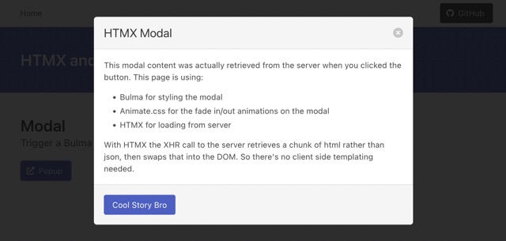

# mingo

A minimal WebApp + API + DB template/cookie-cutter/starter app, written in Go.

## Background

Whenever I need a tiny WebApp my go-to "stack" today is Python + venv + Flask + sqlite. It's always worked out well:
super-fast to make, easy to change in future and it's cross-platform. Deploying with dependencies has always niggled me
with this stack though, I've had a few opinions of the "best" approach to this over the years: cx_freeze, pip, poetry,
docker.

## What Does This Project Do?

Could i use Go to make a "cookie cutter" starter template that's even easier to deploy than a single .py script? I've
never written Go before but i already know the answer to that is YES. Static binaries with go:embed FTW! However, the
point of this repo is to learn what happens next...

What if the app now needs to scrape a webpage? What if it needs to SSH into another server and grab some files? What if
it needs to traverse some directories while reading and writing some files? These are all utterly trivial to do in a
Python script. How approachable are these tasks in Go, while still maintaining a decent developer experience & easy
deployment strategy?

## Developer Setup

I want to document everything i did to make this, so that i can refresh quickly when i come back to it in future.

I installed:

- Go, i'm using v1.18 (latest available today)
- An IDE or Editor<sup id="b1">[1](#f1)</sup> VSCode with gopls in my case

### Initial Setup

I'm winging this with the help of the [Learn Go with Tests site](https://quii.gitbook.io/learn-go-with-tests/) (which
has been awesome so far) and the [official doc's tutorial section](https://go.dev/doc/).

Looks like go has historically struggled with modules, however it seems fine today. To create a new app, i needed to:

1. `mkdir ~/Code/local/myproject`
1. `go mod init example.com/myproject`

To refer to a local dependency:

1. `go mod edit -replace example.com/otherproject=../otherproject`
1. `go mod tidy`

### Basic Developer Experience Tooling

Go itself ships with `go vet` for linting but cli tools like `golangci-lint` can be `brew install`'ed or natively
installed. For example, to natively install staticcheck, another lint tool:

1. `go install honnef.co/go/tools/cmd/staticcheck@latest`
1. `staticcheck .`

I went with `golangci-lint` and to configure it in VSCode, i had to add the following to my user settings json:

```
  ...
  "go.lintTool": "golangci-lint",
  "go.lintFlags": [
    "--fast"
  ],
  ...
```

### The Plan

I want to achieve:

* A simple to hack code base: I want a single Go source file _if_ the code can be kept small and structured in an
  accessible way
* Easy deployment: I want a single binary file for distribution. Also, sqlite already gives me easy backups & state
  management (the db is just a file)
* Learn if i think i can be as productive in Go as in Python: I'll test-drive a few common scenarios

So I plan to implement the following and tag the git repo when i'm happy with each step:

1. A basic unit test, i'll implement & test command line flag parsing
    * I'll explore continuous test running after each change in my editor
1. Serve a static net/http endpoint _(I've decided i want minimal dependencies in this project, so i'll use net/http
   from go's stdlib)_
1. Serve a file endpoint _(I've decided to test-drive [htmx](https://htmx.org/) in this project so i'll serve that .js
   library)_
    * I'll explore go:embed with the aim of being able to distribute a single binary, cross-compiled for each deployment
      platform
1. Serve an htmx-driven CRUD page
    * I'll explore live-reloading options
1. Persist data in a sqlite DB
1. Setup schema migrations
1. Connect to a remote json API and parse the results
1. Traverse the filesystem and edit some files
1. (Safely) Run an external command with user provided input

### Development Log

Notes of my experiences as I implement each part of the plan above.

#### Milestone 1: Testing & Command Line Args

The built in flag package can be made to comply with GNU-ish conventions but it's not the default. Probably the Go
defaults reflect Plan9 OS's conventions? For example, i'd want single hyphen with single letter flags and double hyphen
with word flags, e.g. "-h" and "--help" but flag wants to steer you to "-help". Indeed with my program, all 3 have
become valid since i can't stop handling of the "-help" case. Making flag usage testable was ok-ish to do.

* Feeling: stoked, i've been wanting to test-drive Go for ages and it's fun
* Time spent (estimate): 2 hours

####  Milestone 2: Serve an HTTP Endpoint

You could do this *much* faster if you're willing to go with really basic behaviours but i wanted formatted logging,
clean termination, parse-don't-validate style modelling of constraints like "valid network port" in the type system and
of course i wanted to keep everything testable, which mostly means i wanted to use the dependency injection pattern
everywhere.

Mirroring my experience yesterday with the flag package, i found log to be a little bit under-powered but it didn't stop
me doing what i wanted and ultimately that's what counts. I'm absolutely conscious that i could have had an easier ride
with config, flags and logging by installing dependencies like viper, cobra & golog but i want to stick with zero
external deps.

Finding https://gist.github.com/creack/4c00ee404f2d7bd5983382cc93af5147 was a *major* help. I had a bunch of "basic"
behaviours i wanted for my server and i'd have implemented them but this person did it nicer than i know my first
attempt in Go would have been! They even added tracing which was a bonus that wasn't on my must-have's list. One thing
they were missing was logging of HTTP Status code - this meant i had to ditch their defered goroutine approach because i
need strict ordering (http handler *then* log result) but i have a sneaky suspicion there's a performance change by
doing this. I don't know if it's positive or negative so i'll need to load test it later when i do my acceptance testing
at the end.

I'm starting to form an opinion of my productivity in Go, bearing in mind i've never written Go before, i'm more
productive right now than in vanilla Java (NB: excluding use of Spring). I'm more productive sooner than i expected, i
attribute that to Go reliably doing what i expect. i haven't had a "Wow! I didn't expect that?!" moment to shake my
confidence yet. There are some oddities right enough: date/time formatting literals, although it works just fine; also
the const keyword is less useful than i'd hope for.

I'm a little bit unsure about some loose ends such as the HTTP Content-type header i'm not setting anywhere yet, i
suspect it's probably serving a default text/html type for me. I haven't told the ServeMux router what HTTP methods to
accept. I have no idea how to apply backpressure to incoming requests. I'm a little bit worried about unneccessary heap
pressure in the hot-path of serving requests, for example, LoggingResponseWriter is created for every request - now it's
ultimately just an int and a reference to an existing writer, but in the hot-path, you don't want to be throwing fresh
junk for the garbage collector each time. That said, i'm serving requests in around 17 micro seconds on an M1 Macbook
Air, that'd be 50k-ish req/sec roughly.

I love the [Learn Go With Tests](https://quii.gitbook.io/learn-go-with-tests/meta/why) site, as i've gone through more
of it, i've just found more that i like.

I think my initial goal of a single .go source file is misguided. That idea was based on my thoughts & desires for
simplicity before i had experienced writing Go. Now with some experience, a single .go source file is not the right way
to go about that.

I like the built in testing facilities, there's nice touches like you can provide "example" tests and they're included
in generated docs.

Another thing i like about Go is the community has definitely got the memo on unit testing, this is a breath of fresh
air when i'm coming from working with Java where developers usually lean heavily towards integration testing. There's a
place for both of course but many Java developers would disagree with unit testing being less painful because the common
Java unit testing idiom is to treat "unit test" as meaning test a class at a time which is of course painful.

* Feeling: reflective, Python is more expressive but so far i prefer Go over Java8
* Time spent (estimate): 8 hours

####  Milestone 3: Serve a File Endpoint

Ok now THAT was cool. Go embed is *awesome*. I can see so many use cases for simplifying distribution. My entire binary
is now just over 6mb with the embedded html/css/js artifacts. I *wish* my usual docker containers were only 6mb, this
really is the neatest feature of Go so far. It was so ridiculously easy too.

I'm not sure about my use of Go's testing facilities. I feel like my tests are quite long winded. I've joined the Go
discord, i'm going to ask in there for a code review from someone versed in idiomatic Go.

##### Integration Testing a fork'd & exec'd Binary Detour

I took a couple of detours today. For the first, I made a separate toy project to explore a test that `os.Exec()`'s a "
go run ." in another process. I kept running into issues when i tried this yesterday, specifically the "go run ." i was
invoking from the tests was different or at least was not exposing my flags as it did when i run from the CLI. Either
way, i got it working without any dramas this time so if i change my mind about the current setup in this project (I
call `main()` in a go routine) then i can switch over.

#####  HTMX Bulma, FontAwesome & Animate.css Detour




I just finished another detour, this time into [HTMX](https://htmx.org/). I *really* want to like HTMX but i can see
sharp edges.

I'll start with the bad bits. I think HTMX could be fine for small, short-lived toys (i.e. this project's use case) but
it has a slower learning curve than jQuery. The lack of help for the developer to avoid accidentally leaving behind
pollution of the DOM with old elements or event listeners is annoying. I spent time manually watching the inspector in
Firefox while testing each possible interaction to make sure i was clean. There's no intellisense/auto complete/linting
in my editor. The testing strategy is not clear to me either, other than going full-fat e2e tests which are easy to make
slow and brittle. I really want some ergonomic unit testing support to let me work quickly with components, isolated
from the distraction of the rest of my web server stack. I haven't intuited how deep linking could work yet, like if i
want to link to page 2 of a paginated table, how would i do that with HTMX?

The good bits. It's a lot faster to add to a project like this (just source in the .js file) than building then bundling
a create-react-app. The HTMX documentation site is fantastic, zero fluff, entire topics on single big pages so it's
super fast to flip to that tab and ctrl+f for stuff in the browser. HTMX wants you to consider https://hyperscript.org/
and that does looks cute in the HTMX examples but it's almost 100kB and that goes against the ethos of this particular
project. Also I'd be concerned about giving up the rich JS developer tooling of the browser (breakpoints, profiling
etc.) just to get a cute syntax instead of my 10 lines of JS.

In summary and with all this said, i think i will be likely to choose HTMX (maybe even with hyperscript) when i'm
considering jQuery in future.

[Bulma](https://bulma.io) is still awesome as ever. I only have good things to say about the product but HTMX's
documentation layout, their "information architecture", is better (albeit less flashy). Bulma's is spread across pages
and you have to think like them to find stuff in it. E.g. where is typography going to be in the docs hierarchy? I'd
much rather a single big page i can just ctrl+f in when i'm developing and not interested in (very aesthetically
pleasing) distractions.

FontAwesome feels frustrating as ever. I see there's *another* major version, FA6! And you guessed it, all the names
have changed again.

I'd never heard of [Animate.css](https://animate.style/) before today but that was a fantastic first experience. A big
thumbs up for their interactive documentation site too that has a very cute way of letting you test each animation.

##### Final Words for Today

With the HTMX detour, it instantly made me realise the go:embed is only for distribution. During dev you need reloading
from the filesystem without having to rebuild & restart your go binary when some HTML changed (even if go's build is so
fast that you'd still be faster than a java dev doing the same thing...). Mercifully adding this is ultimately a 1 line
change.

* Feeling: vindicated investing time test-driving Go, go:embed is what i hoped would be possible in Go
* Time spent (estimate): 3 hours

####  Milestone 4: Serve a CRUD SPA

That acroynm overload is a Create Read Update Delete, Single Page Application...

##### Choosing an IDE You're Happy With

I miss Intellij. I switched to VSCode 18 months ago and it's an awesome editor but most language plugins are
underpowered. I just sketched out a test case there and then it came time to implement, now in intellij it's just a
keystroke to add a missing method. That's missing in the Go plugin for VSCode but i'll put money on it being present in
Jetbrain's Goland IDE. The debugger refuses to work and there's been other minor annoyances. Even silly things like "
.for" postfix snippets etc. Anway, not today's topic.

**2022-05-15:** Update so for the past few times i've had some spare time to fiddle with this project, i've been using GoLand. I ended up more frustrated with it than the few minor missing features in VSCode! It crashes constantly in the Markdown plugin and the Go Language support is not at the level of Jetbrain's Java support in Intellij. I've come back to VSCode.

##### Structuring Go Code

My initial idea of everything in one file is just *flat wrong* for Go but i'm going to push this anyway and see if it
gets unbearable or if it just stays ugly. I feel like Go is steering me toward consciously architecting this app like i
would in Java. I mean like "ports and adapters" or hexagon or whatever you want to call that style - you know what i
mean, the sterotypical microservice arch.

Going into this, i was aiming for a more Python Flask-esque quick and slick thing so that's what i'm sticking with. So
there will be no use case services orchestrating domain interactions while juggling authorisation and backpressure in
this demo app!

**2022-05-15:** So for the past few sessions i've been refactoring the layout of this app, away from the single file idea and hard to the other extreme of what i'd describe as "enterprise Java" layout. Based on my experiences now, i'm happy the sweet spot is actually in the middle of these extremes, so a bit more condensed than what you see in the repo under tag v4 just now.

##### Fake DB

When i wrote my plan i put CRUD app before DB, i should probably switch the ordering but to heck with it. I'm going to
impl a Fake DB in this iteration to support my CRUD app.

An hour later i'm glad of the decision to force the bad choice for the fun of where it might end up... so here's an
insight i would have otherwise missed. With HTMX, because we're not reloading the page on dataset changes, managing
operations gets complicated and expensive to resolve. I first implemented some pagination, hats off to HTMX, it was easy
and obvious to do, i say obvious because the solution is consistent with how you use HTMX generally. I learned about
HTMX's attribute inheritance (handy and cool), i struggled with overriding inheritance (turns out for overriding
hx-confirm you don't hx-disinherit, you set hx-confirm="unset"). Then i added a delete button to the rows, again super
quick and obvious to add.

What happens if you pull 1 page of rows, then delete a row, then pull the next page of rows? In an MPA (multi page app),
there's no problem here - the delete action causes a page refresh and your pagination links are offset by 1. In a client
side SPA there's still no problem because in your delete handler you update your store client-side and now any further
clicks on pagination links will refer to the updated state. In this HTMX hybrid of SPA/MPA, you don't have a convenient
way to tell another element in another part of the dom to update its hx-get value. Of the solutions i can see, none are
satisfactory. I could hx-swap the entire table on delete, this is akin to a page refresh and doesn't work well with my
dynamic pagination. Alternatively i could go for the SPA style solution and update the hx-get parameters after a delete,
which just means adding some client side JS to handle this scenario and kind of defeats the point of HTMX. I could
always add that 100kb hyperscript dependency and that would make this trivial with no JS but that extra dependency is
against the spirit of this project.

**2022-05-15:** I've got my head into HTMX's way of thinking a bit more now, HTMX replaces whatever you would use to do your XHR requests (jquery, fetch, axios, React Query). It's not a replacement for UI interactivity embelishments like jquery or react. Instead, AlpineJS looks like the answer there so in the next iteraction, AlpineJS will be complimenting HTMX in this toy app.

##### Go Generics

I took the chance to try Go Generics. I needed a min() function and while i didn't really need to make that Generic (i
only needed an int type), this is an experiment project so i decided to try it out:

```
func minGeneric[T constraints.Ordered](a, b T) T {
	if a < b {
		return a
	}
	return b
}
```

Looking at Ordered, it supports int & float for now but promises to add any new types in future that support ordering

My favourite min() i've seen is in Common Lisp:

```
(min 5.0 -3 0 -1)
;; -3
```

And ultimately this is what i had in mind when i started minGeneric, a generic and variadic min. I couldn't get the
compiler to take `...T` for a variadic generic function and i looked up the spec for Go 1.18 and this isn't supported
yet.

My variadic (but not generic) version comes out a few lines longer but feels more ergonomic to use than the Generic
version:

```
func minIntVariadic(a int, bs ...int) int {
	for _, b := range bs {
		if b < a {
			a = b
		}
	}
	return a
}

minIntVariadic(1, -2, 3, -4)
s := []int{-2, 3, -4}
minIntVariadic(1, s...)
```
goos: darwin
goarch: arm64
BenchmarkMinImplementations/math.Min-8          261596238                4.282 ns/op
BenchmarkMinImplementations/minGeneric-8        588252955                2.037 ns/op
BenchmarkMinImplementations/minVariadic-8       413756245                2.827 ns/op

**2022-05-15:** thanks to @Groxx i now have a generic & variadic implementation, sweet! It's the same speed as minVariadic.


##### HTMX Usage

To make things a bit more interesting than just a CRUD table, i added a dynamic loading function to the table. On page
load, the table has no rows but contains a button "Load More...", each click renders two more rows until no more rows
are available then the button is removed from the DOM. There probably isn't a legitimate use case for this in the wild
but i wanted to explore more of HTMX. It has shown me some limitations of the HTMX approach but also the idiomatic ways
to workaround them. Specifically a common apporach with HTMX is just to replace bigger chunks of the page content when
you encounter these kinds of sync issues. I think that's totally fair, it's simple to understand and simple to
implement.

**2022-05-15:** Now i'm a bit more au fait with HTMX, i think the above is grounded in a misunderstanding of mine about the purpose of HTMX. I think i was too harsh on it and my expectations weren't aligned with the problem HTMX solves (replacing XHR+JSON, it's not for general purpose UI interactivity embelishments).

##### Restructuring

https://github.com/golang-standards/project-layout

In the last iteration it became clear that a monolithic main.go file was not the way to "Go" (_groan_). The ideal package
layout (i keep wanting to say module, go has reversed the meaning of "package" and "module" for me) is still not clear to me so i figured i should try swinging hard to the other extreme, more akin to "enterprise Java" and see what i learn.

I wanted to learn more about Go & Enums (it doesn't have them) so i decided to codify the concept of a lifecycle in this app. Kind of like Spring's. What i mean by "lifecycle phase" is that the application goes through some states
in its lifetime:

* it bootstraps itself by looking at the runtime environment, distills a configuration then assembles its components
* it enters the main lifecycle phase and begins to serve http requests
* there's a short-lived graceful shut down phase that occurs when a SIGINT or SIGTERM are received

So i wanted typesafe enums and if possible, something close to sum types. I ended up with opaque enums which is cool so i got my type safety. VSCode's support for unused code helps but it's not quite sum types - the first usage of each enum constant in a test for example, renders the IDE "unused field" colouring useless.

##### Bazel

Well i felt like another detour, this time via Bazel. This project started as a toy to complete in a couple of days, so many detours :-) but it's been *awesome* fun so i'm just going to keep with the detours for now. Anyway, Bazel.

Bazel's TL;DR as i understand it right now is: don't describe imperative build tasks like Gradle, don't describe declarative build tasks like Maven, instead ditch tasks (or milestones) altogether and make artifacts (e.g. a library or a binary to be generated) the primary unit of organisation. To achieve artifact X, take these inputs and rely on Bazel's rules to achieve the how (e.g. invoke compiler) and when (e.g. in parallel with Y).

**Bazel Notes:**

* Artifact rather than task (Gradle, Maven) based. Define what you want (this java binary or library) and rely on Bazel's rules to achieve the how (invoke javac) and when (parallel)
* A system for taking defined inputs and producing an output
* Decides whether to reuse prior output rather than rebuild - if inputs never changed, and all actions are **supposed** to be deterministic, then dont rebuild
* Developers can write side effectful "actions", which is bad. Actions are the lowest unit of composition which minimises harm
* Bazel actively fights against bad behaviour, builds run in isolation cells via LXC, only the files declared as deps are available to the rule and any file generated thats not listed in the rule is discarded
* Think functional programming rather than imperitive
* Dependencies are hashed like a lockfile - you can always see in VCS when a dep changed. Refuses to use if hashes dont match
* Build configurations:
	* Host config defines what tools, eg javac are available
	* Target config defines binary to be built
* You can add custom rules
	* Info providers are data containers, ccInfo contains c specific info from the build
	* Rule file has inputs, lists actions done, and the providers refernce the outputs created
* Bazel has 3 phases: loading, analysis and execution
* In addition to rules there are also macros
* Rules are written in starlark and have a .bzl extension
* Attributes are rule arguments, like a dependency list or sources lost for example

**Bazel Usage:**

* bazel build //...
* bazel test //... --test_output=errors
* bazel test //internal/pkg/stdlibext:stdlibext_test --test_arg=-test.bench=. --test_output=all   # run a benchmark
* bazel run //cmd/mingo
* bazel run //:gazelle  # regen all the build files
* bazel run //:gazelle-update-repos  # update deps from go.mod after a "go mod tidy", depends on config in WORKSPACE
* bazel clean

I encountered a bazel issue switching from GoLand back to VSCode and had to tell bazel to ignore it's own bazel* dirs in the root of the project.

I haven't wrestled with making a binary artifact available in the context of an integration or end-to-end test yet.

####  Milestone 5: Persist Data in a SQLite DB

Not much to say about this milestone, it was about 10 lines of code.

---

<b id="f1">1</b> I've chosen VSCode with the "gopls" language server. Here's a little cheat-sheet for the essential
shortcuts to get stuff done: [↩](#b1)

- Lookup:
    - Definition: Opt+F12
    - References: Shift+F12
    - Implementations: Shift+Cmd+F12
    - Parameter docstrings: Shift+Cmd+Space
    - Autocomplete: Ctrl+Space
- Go:
    - Definition: F12
    - Test: Ctrl+Shift+T (custom mapping)
    - File: Cmd+P
    - Back: Ctrl+-
    - Forward: Ctrl+Shift+-
    - Bracket: Shift+Cmd+\
    - Position: Alt+/+<char> (with MetaJump Plugin)
- Refactor:
    - Rename: F2
    - Extract Variable: Alt+Cmd+V (custom mapping)
    - Extract Function: Alt+Cmd+E (custom mapping)
        - Use Ctrl+Shift+Arrow to select code first
    - Inline: ???
    - Move: ???
- Run:
    - App: Ctrl+F5
    - All Tests: Cmd+; A
    - Current Test: Cmd+; C
    - To Breakpoint (Debug): F5
- Close
    - Sidebar: Ctrl+B
    - Bottom bar: Cmd+J
    - Editor Tab: Cmd+W
    - All Editor Tabs: Cmd+K, W
    - Project: Cmd+K, Cmd+F
- Split Editor
    - Vertically: Cmd+\
    - Horizontally: Cmd+K, Cmd+\
- Focus Editor: Escape (custom mapping)
- Toggle Focus Between Terminal & Editor: Ctrl+` (custom mapping)
- File Explorer: Shift+Cmd+E
- Find: Shift+Cmd+F
- VCS: Ctrl+Shift+G
- Undiscoverable-but-Useful Snippets:
    - helloweb: Hello world webapp
    - pkgm: Package main + main func
    - ims: Import packages
    - cos: Define constants
    - tf: Test function
    - ef: Example function
    - bf: Benchmark function
    - tdt: Table driven test
    - ff: fmt.Printf("...", var)
    - lf: Printf with var + newline
    - lv: Log variable content
    - las: Http listen and serve
    - hf: Http Handle Func
    - wr: Http response writer
    - hand: Http handler
    - rd: Http redirect
    - herr: Http error
    - df: defer statement
    - meth: Method declaration
    - sort: Custom sort impl
